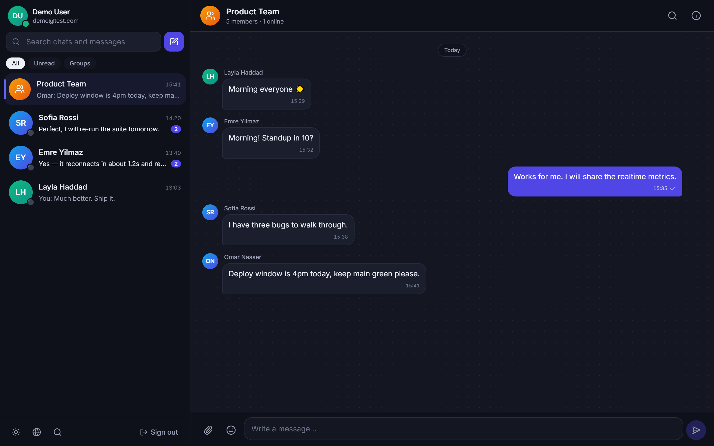
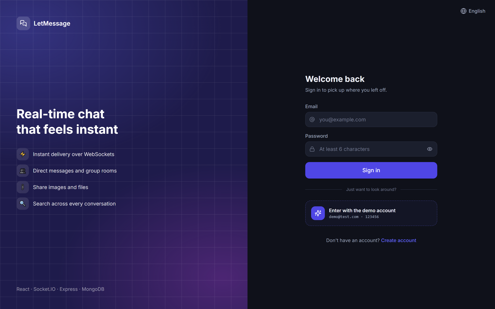
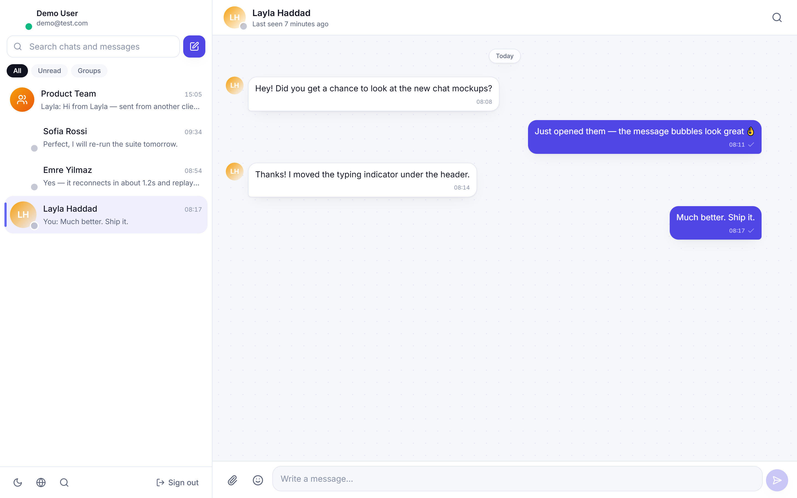
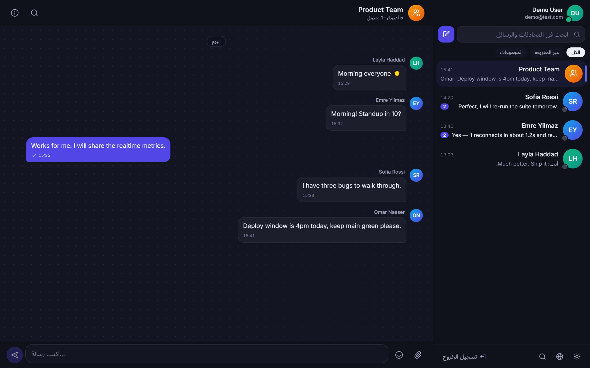
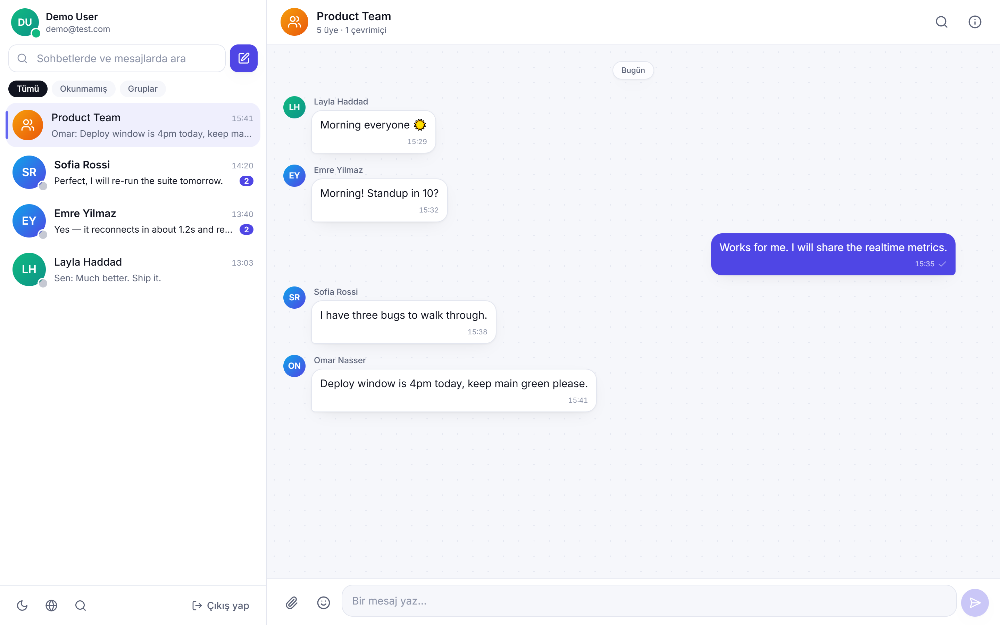
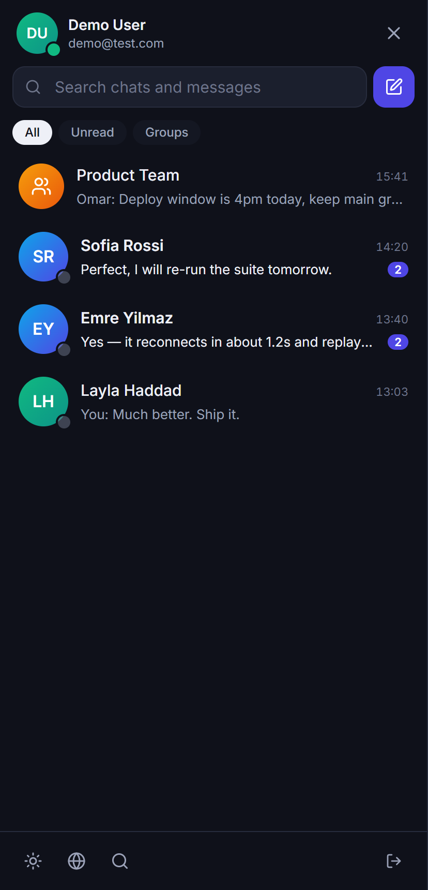
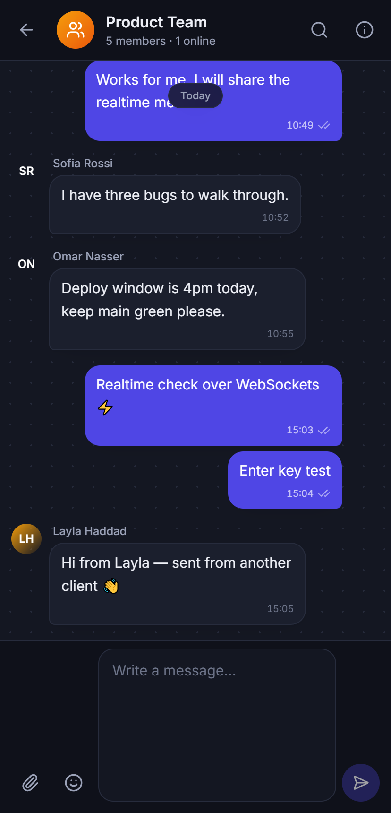

<div align="center">


# LetMessage

**Real-time chat with direct and group rooms, typing indicators, presence, read receipts, file sharing and search.**

Built on WebSockets — not polling — with a React front-end, an Express + Socket.IO API and MongoDB.

[](https://github.com/azoz20032021/letmessege/actions/workflows/ci.yml)


**[Live demo](#) · [Try it with `demo@test.com` / `123456`](#try-it-without-signing-up)**

</div>

---

<div align="center">
  
</div>

---

## Try it without signing up

The sign-in screen has a one-click **“Enter with the demo account”** button, so a
reviewer never has to register.

| | |
|---|---|
| **Email** | `demo@test.com` |
| **Password** | `123456` |

The account comes pre-loaded with three direct chats, a five-person group and
unread messages waiting. Four teammate accounts (`layla@`, `emre@`, `sofia@`,
`omar@test.com`, all with the password `password123`) exist too — sign in as one
of them in a second browser to watch messages, typing indicators and presence
update live between two windows.

---

## What it does

| | |
|---|---|
| ⚡ **Instant messaging** | Messages travel over a Socket.IO WebSocket with an ack, not an HTTP round trip. The bubble renders optimistically and is reconciled when the server confirms; a failed send is marked and retryable. |
| ✍️ **Typing indicators** | Per-room, debounced, and self-healing — the server expires a typing state after 4s so a dropped “stop” event can never leave the dots spinning. |
| 🟢 **Presence** | Online/offline and last-seen, tracked per socket. Someone on a phone *and* a laptop only flips to offline when the last tab closes. |
| ✓✓ **Read receipts** | One tick sent, two grey delivered, two blue read by everyone in the room. |
| 👥 **Direct & group rooms** | 1-to-1 rooms are deduplicated so both sides always land in the same conversation. Groups have admins, member management and system messages. |
| 📎 **Images & files** | Up to 5 attachments per message via drag-and-drop or the picker, with an upload progress bar and an image lightbox. Cloudinary in production, local disk without credentials. |
| 🔴 **Unread counts** | Derived from a per-member read cursor, so the badge is correct across devices — not a counter that drifts. |
| 🔍 **Search** | Full-text across every conversation you belong to, with the matched substring highlighted. |
| 🌍 **English · العربية · Türkçe** | Full i18n with real plural rules per language, and proper RTL for Arabic — including per-message bidi isolation. |
| 🌗 **Light & dark** | One set of semantic colour tokens; the theme is applied before first paint so there is no flash. |
| 📱 **Responsive** | A two-pane desktop layout that becomes a drawer + conversation view on mobile. |

---

## Screenshots

<table>
  <tr>
    <td width="50%"></td>
    <td width="50%"></td>
  </tr>
  <tr>
    <td align="center"><b>Sign in</b> — one click into the demo account</td>
    <td align="center"><b>Light mode</b> — direct conversation</td>
  </tr>
  <tr>
    <td></td>
    <td></td>
  </tr>
  <tr>
    <td align="center"><b>العربية</b> — the whole layout mirrors to RTL</td>
    <td align="center"><b>Türkçe</b></td>
  </tr>
</table>

<div align="center">
  
  
</div>

> Regenerate every image with `npm run screenshots` (drives your installed Chrome — nothing extra is downloaded).

---

## Tech stack

**Front-end** — React 18 · TypeScript · Vite · Tailwind CSS · Zustand · React Router · socket.io-client · react-i18next · Framer Motion

**Back-end** — Node.js · Express · Socket.IO · MongoDB + Mongoose · JWT · bcrypt · Zod · Multer · Cloudinary

**Tooling** — Jest · Supertest · mongodb-memory-server · Docker · GitHub Actions

---

## Getting started

### Prerequisites

Node 18+ and a MongoDB. If you do not have MongoDB installed, the repo ships a
throwaway in-memory one — see step 2.

### 1. Install

```bash
git clone https://github.com/azoz20032021/letmessege.git
cd letmessege
npm install
```

This is an npm workspace, so one install covers both `server/` and `client/`.

### 2. Configure

```bash
cp server/.env.example server/.env
cp client/.env.example client/.env
```

Generate a real JWT secret and paste it into `server/.env`:

```bash
node -e "console.log(require('crypto').randomBytes(48).toString('hex'))"
```

Point `MONGODB_URI` at your database. **No MongoDB installed?** Leave the
default and start the bundled in-memory one in its own terminal:

```bash
npm run dev:db
```

It listens on `127.0.0.1:27017` and forgets everything when you stop it, so
re-run the seed after each restart.

### 3. Seed the demo data

```bash
npm run seed
```

Creates `demo@test.com / 123456` plus four teammates and a set of realistic
conversations, so the app never opens on an empty screen. Add `-- --fresh` to
wipe first.

### 4. Run

```bash
npm run dev
```

| | |
|---|---|
| Web | http://localhost:5173 |
| API | http://localhost:5000 |
| Health | http://localhost:5000/api/health |

Vite proxies `/api`, `/uploads` and `/socket.io` to the API, so the browser sees
a single origin in development and cookies just work.

### With Docker instead

```bash
cp .env.example .env      # fill in JWT_SECRET and JWT_REFRESH_SECRET
docker compose up --build
docker compose exec api npm run seed
```

Web on `:8080`, API on `:5000`, MongoDB on a named volume.

---

## Architecture

```
letmessage/
├── server/                    Express + Socket.IO API
│   ├── src/
│   │   ├── config/            env, database and Cloudinary wiring
│   │   ├── models/            User · Conversation · Message
│   │   ├── controllers/       one module per resource
│   │   ├── routes/            thin routing, validation lives in middleware
│   │   ├── middleware/        auth · validation · rate limits · errors · uploads
│   │   ├── services/          conversation serialisation, unread + read state
│   │   ├── socket/            realtime layer (see below)
│   │   ├── validators/        Zod schemas shared by REST and sockets
│   │   ├── utils/             tokens, storage, logger, seed
│   │   ├── app.js             the Express app (importable by tests)
│   │   └── server.js          HTTP server + socket bootstrap
│   └── tests/                 Jest: REST, realtime and unit
│
└── client/                    React single-page app
    └── src/
        ├── components/        ui/ primitives · chat/ · layout/
        ├── pages/             AuthPage · ChatPage
        ├── store/             Zustand: auth · chat · ui
        ├── lib/               API client, socket client, formatting
        ├── i18n/              en · ar · tr
        ├── hooks/             sticky scroll, click-outside, debounce, …
        └── types/             shared domain types
```

### How a message travels

```
┌────────────┐  1. message:send (+ack)   ┌──────────────┐
│  Sender    │ ────────────────────────▶ │              │
│  (browser) │ ◀──────────────────────── │  Socket.IO   │
└────────────┘  4. ack { message }       │              │
      │                                   │   server     │
      │ optimistic bubble                 │              │
      ▼                                   └──────┬───────┘
  renders instantly                    2. persist │
                                                  ▼
                                          ┌──────────────┐
                                          │   MongoDB    │
                                          └──────┬───────┘
                                    3. fan out to │ room members
                       ┌──────────────────────────┴───────────────┐
                       ▼                                          ▼
              ┌────────────────┐                         ┌────────────────┐
              │  In the room   │                         │  Elsewhere in  │
              │  message:new   │                         │  the app       │
              │  → new bubble  │                         │  message:      │
              └────────────────┘                         │  delivered     │
                                                         │  → badge +     │
                                                         │    preview     │
                                                         └────────────────┘
```

Two fan-out events rather than one is deliberate: a member sitting in the room
needs the message appended to the thread, while a member looking at a different
conversation needs their sidebar badge and preview refreshed without loading the
thread at all.

### Design decisions worth calling out

**Sending is optimistic, with a real failure state.** The bubble appears the
moment you hit Enter and carries a `tempId`. The server's ack returns the saved
message plus that id, so the placeholder is swapped rather than duplicated. No
ack means the bubble is marked failed with a retry action instead of vanishing.

**Unread counts come from a read cursor, not a counter.** Each conversation
stores a `readState` map of `userId → timestamp`. The badge is a `countDocuments`
of newer messages from other people. A counter incremented on send and
decremented on read drifts the first time a socket event is missed; a cursor
cannot.

**Presence counts sockets, not users.** A `Set` of socket ids per user means
opening a second tab does not flip you offline when you close the first.

**Typing state expires server-side.** A 4-second timer clears it even if the
client's “stop” event never arrives — a disconnected browser cannot leave the
dots spinning for everyone else.

**Uploads degrade gracefully.** With Cloudinary credentials, files go to
Cloudinary. Without them, they are written to `server/uploads` and served
statically — so the project runs end-to-end with zero third-party accounts.

**One error contract.** Mongoose validation errors, Multer limits, Zod failures
and thrown `ApiError`s all leave the API in the same shape
(`{ success, message, code, details }`), so the client has exactly one thing to
handle.

**RTL uses logical properties.** `ms/me`, `ps/pe`, `start/end` and `border-e`
mean Arabic mirrors the entire layout with no second stylesheet, and each
message carries `dir="auto"` so an English line inside the Arabic UI keeps its
own punctuation and truncation.

---

## API

All routes are prefixed with `/api`. Authenticated routes expect
`Authorization: Bearer <accessToken>`.

<details>
<summary><b>Auth</b></summary>

| Method | Route | Description |
|---|---|---|
| `POST` | `/auth/register` | Create an account |
| `POST` | `/auth/login` | Sign in |
| `POST` | `/auth/demo` | One-click sign-in as the seeded demo user |
| `POST` | `/auth/refresh` | Exchange the refresh cookie for a new access token |
| `POST` | `/auth/logout` | Sign out |
| `GET` | `/auth/me` | The current user |

</details>

<details>
<summary><b>Users</b></summary>

| Method | Route | Description |
|---|---|---|
| `GET` | `/users?q=` | Search people |
| `GET` | `/users/online` | Ids of everyone currently connected |
| `GET` | `/users/:id` | A single profile |
| `PATCH` | `/users/me` | Update name, bio or language |
| `POST` | `/users/me/avatar` | Upload an avatar |

</details>

<details>
<summary><b>Conversations</b></summary>

| Method | Route | Description |
|---|---|---|
| `GET` | `/conversations` | Your conversations, newest first, with unread counts |
| `POST` | `/conversations` | Create a direct or group conversation |
| `GET` | `/conversations/:id` | One conversation |
| `PATCH` | `/conversations/:id` | Rename or describe a group *(admin)* |
| `POST` | `/conversations/:id/read` | Mark everything read |
| `POST` | `/conversations/:id/members` | Add members *(admin)* |
| `DELETE` | `/conversations/:id/members/:userId` | Remove a member, or leave |
| `GET` | `/conversations/:id/messages?limit=&before=` | Message history, cursor paginated |
| `POST` | `/conversations/:id/messages` | Send a message |
| `POST` | `/conversations/:id/messages/upload` | Send with attachments (multipart) |

</details>

<details>
<summary><b>Messages & uploads</b></summary>

| Method | Route | Description |
|---|---|---|
| `PATCH` | `/messages/:id` | Edit your own message |
| `DELETE` | `/messages/:id` | Soft-delete *(sender or group admin)* |
| `GET` | `/messages/search?q=&conversationId=` | Search your messages |
| `POST` | `/uploads` | Store up to 5 files, returns attachment descriptors |

</details>

### Socket events

Handshake: `io(url, { auth: { token } })` — the same access token as REST.

| Direction | Event | Payload |
|---|---|---|
| → | `conversation:join` | `{ conversationId }` — also marks the room read |
| → | `conversation:leave` | `{ conversationId }` |
| → | `message:send` | `{ conversationId, text, attachments, replyTo, tempId }` → ack `{ success, message, tempId }` |
| → | `message:read` | `{ conversationId }` |
| → | `typing:start` / `typing:stop` | `{ conversationId }` |
| ← | `connected` | `{ userId, socketId, rooms }` |
| ← | `presence:online-users` | `{ userIds }` on connect |
| ← | `presence:user-online` / `presence:user-offline` | `{ userId }` |
| ← | `message:new` | `{ conversationId, message }` — to everyone in the room |
| ← | `message:delivered` | `{ conversationId, message, conversation }` — to members outside the room |
| ← | `message:edited` / `message:deleted` | `{ conversationId, … }` |
| ← | `message:read` | `{ conversationId, userId, at }` |
| ← | `typing:update` | `{ conversationId, userId, name, isTyping }` |
| ← | `conversation:created` / `conversation:updated` | `{ conversation }` |

---

## Tests

```bash
npm test                 # 55 tests
npm run test:coverage --workspace server
```

Jest runs against an ephemeral in-memory MongoDB, so no setup is needed and no
real database is touched.

| Suite | Covers |
|---|---|
| `auth.test.js` | Registration, password hashing, login, refresh cookies, demo sign-in, token rejection — including that a wrong password and an unknown email return the *same* error, so the endpoint cannot enumerate accounts |
| `conversation.test.js` | Direct-room deduplication, group creation, admin rules, membership changes, and that a non-member gets a 403 |
| `message.test.js` | Sending, cursor pagination, unread counts, edit/delete permissions, soft delete, and search — including that regex metacharacters in a query are treated as literal text |
| `socket.test.js` | Real socket.io clients end to end: handshake auth, presence across multiple devices, cross-client delivery, typing broadcast (and that it is not echoed to the sender), read receipts |
| `presence.test.js` | The presence registry and regex escaping as units |

To run the suite against an existing MongoDB instead of the in-memory one:

```bash
MONGODB_TEST_URI="mongodb://127.0.0.1:27017/letmessage-test" npm test
```

---

## Deployment

The front-end and API deploy separately.

### Front-end → Vercel

1. Import the repo, set **Root Directory** to `client`.
2. Add `VITE_API_URL` = your API's public URL (no trailing slash).
3. Deploy. `client/vercel.json` handles the SPA fallback and caching.

### API → Render or Railway

**Render** — New → Blueprint → pick the repo. `render.yaml` sets the root
directory, health check and generated JWT secrets; fill in `MONGODB_URI`
(MongoDB Atlas) and `CLIENT_URL` (your Vercel URL).

**Railway** — New → Deploy from repo. `railway.json` builds `server/Dockerfile`.
Set `MONGODB_URI`, `CLIENT_URL`, `JWT_SECRET` and `JWT_REFRESH_SECRET`.

Then seed the demo account once from the platform's shell:

```bash
npm run seed
```

### Environment variables

**Server** — see [`server/.env.example`](server/.env.example)

| Variable | Required | Notes |
|---|---|---|
| `MONGODB_URI` | ✅ | Atlas connection string in production |
| `JWT_SECRET` | ✅ | The server refuses to start in production with the dev default |
| `JWT_REFRESH_SECRET` | ✅ | Must differ from `JWT_SECRET` |
| `CLIENT_URL` | ✅ | Comma-separated list of allowed origins |
| `PORT` | | Defaults to 5000; Render and Railway inject their own |
| `CLOUDINARY_*` | | Omit to store uploads on local disk |
| `MAX_FILE_SIZE_MB` | | Defaults to 10 |
| `DEMO_EMAIL` / `DEMO_PASSWORD` | | Used by the seed and `/auth/demo` |

**Client** — see [`client/.env.example`](client/.env.example)

| Variable | Notes |
|---|---|
| `VITE_API_URL` | Leave empty in dev so Vite proxies; set to the API origin in production |

> `CLIENT_URL` must include your deployed front-end origin or the browser will
> be blocked by CORS on both the API and the WebSocket handshake.

---

## Notes and limits

- Presence and typing state live in process memory. Running more than one API
  instance needs the [Socket.IO Redis adapter](https://socket.io/docs/v4/redis-adapter/)
  so rooms and presence are shared — the code is structured so that swap touches
  only `socket/presence.js` and the server bootstrap.
- Messages are not end-to-end encrypted; they are stored in plain text and
  protected by transport security and authorisation checks.
- Deleting a message is a soft delete, so the thread keeps its shape and replies
  pointing at it stay meaningful.
- On Render's and Railway's free tiers the API sleeps when idle, so the very
  first request after a pause takes a few seconds to wake it.

---

## License

MIT — see [LICENSE](LICENSE).
